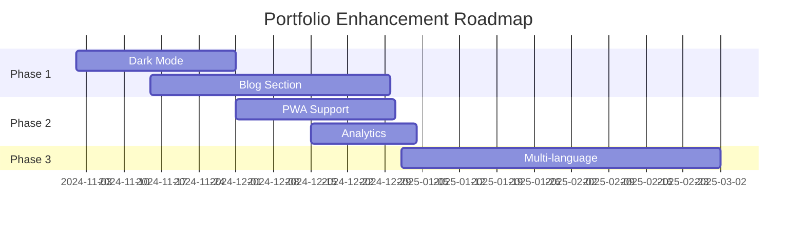

<div align="center">

<!-- Animated Header with Gradient -->


<!-- Typing SVG Animation -->
<p align="center">
  
</p>

<!-- Animated Badges -->
<p align="center">
  
  
  
  
  
</p>

<!-- Animated Divider -->


### ✨ A stunning, modern portfolio showcasing my web development journey ✨

<p align="center">
  <a href="https://araj59197.github.io/Portfolio/">
    
  </a>
  <a href="https://github.com/araj59197/Portfolio/issues">
    
  </a>
  <a href="https://github.com/araj59197/Portfolio/issues">
    
  </a>
</p>


</div>

<br>

<!-- Overview Section with Icons -->
## 🎯 Overview


<p align="left">
A <b>professional, responsive frontend portfolio</b> website built with <b>pure HTML, CSS, and JavaScript</b>. No frameworks, no backend - just clean, efficient client-side code with <b>smooth animations</b>, <b>glassmorphic design</b> elements, and <b>optimized performance</b>.
</p>

<p align="left">
💎 <b>Pure Frontend</b> - No frameworks or libraries<br>
⚡ <b>Lightning Fast</b> - Static site with minimal dependencies<br>
📱 <b>Fully Responsive</b> - Works on all devices<br>
🎨 <b>Modern Animations</b> - CSS & JavaScript powered<br>
🔍 <b>SEO Optimized</b> - Meta tags for better visibility<br>
</p>

<br clear="right"/>

<!-- Features Section with Enhanced Design -->
## ✨ Features

<div align="center">

<table>
<tr>
<td align="center" width="50%">

### 🎨 Design

🎨 **Glassmorphic** effects<br>
💜 **Purple gradient** theme<br>
✨ **Smooth** animations<br>
📐 **Responsive** layout<br>

</td>
<td align="center" width="50%">

### ⚡ Performance

⚡ **Lazy loading** images<br>
🚀 **Optimized** animations<br>
⏱️ **Fast** page load<br>
🔍 **SEO** optimized<br>

</td>
</tr>
<tr>
<td align="center" width="50%">

### 🧩 Sections

🎯 Hero with **animated name**<br>
👤 About with **stats**<br>
🛠️ Skills **showcase**<br>
💼 Projects **portfolio**<br>

</td>
<td align="center" width="50%">

### 📱 Interactive

🎪 **Bouncing letter** effect<br>
✅ Form **validation**<br>
🎬 Scroll **animations**<br>
📱 Mobile **navigation**<br>

</td>
</tr>
</table>

</div>

<br>

<!-- Tech Stack with Enhanced Badges -->
## 🛠️ Built With

<div align="center">


<br><br>


</div>

<div align="center">

| Technology | Purpose |
|:----------:|:-------:|
| **Vanilla JavaScript (ES6+)** | Client-side interactivity & animations |
| **CSS Grid & Flexbox** | Responsive layout system |
| **Intersection Observer API** | Scroll-triggered animations |
| **CSS Custom Properties** | Dynamic theming & styling |
| **SVG Graphics** | Scalable vector logos |
| **HTML5 Semantic Tags** | Better SEO & accessibility |

**🎯 100% Frontend - No Backend Required**

</div>

<br>

<!-- Project Structure with Tree Design -->
##  Project Structure

<div align="center">

```
📦 portfolio/
┣ 📄 index.html          # Main HTML structure
┣ 🎨 style.css           # Comprehensive styling (1900+ lines)
┣ ⚡ script.js           # Interactive functionality
┣ 📖 README.md           # Project documentation
┣ � images/
┃ ┣ 🖼️ personal_image.jpg    # Profile photo
┃ ┣ 💎 project1.svg          # Jewelry website logo
┃ ┣ 📋 project2.svg          # Task reminder logo
┃ ┗ 🛒 project3.svg          # Shopping cart logo
┗ � resume/
  ┗ 📄 ad_resume.pdf     # Downloadable resume
```

</div>

<br>

<!-- Quick Start with Step-by-Step Guide -->
## 🚀 Quick Start

<div align="center">

### 👏 Get Started in 3 Easy Steps!

</div>

<table>
<tr>
<td width="33%" align="center">

### 1️⃣ Clone

```bash
git clone https://github.com/araj59197/Portfolio.git
```
```bash
cd Portfolio
```

</td>
<td width="33%" align="center">

### 2️⃣ Open

**Double-click** `index.html`

*or*

**Right-click** → Open with browser

</td>
<td width="33%" align="center">

### 3️⃣ Enjoy

**View** your portfolio

**Customize** as needed

**Deploy** to the web

</td>
</tr>
</table>

<details>
<summary><b>🔧 Advanced Setup Options</b> (Click to expand)</summary>

<br>

**Option A - Live Server (Recommended for Development):**
```bash
# Install Live Server extension in VS Code
# Right-click on index.html → "Open with Live Server"
```

**Option B - Python Server:**
```bash
# Python 3
python -m http.server 8000
# Visit: http://localhost:8000
```

**Option C - Node.js Server:**
```bash
npx http-server -p 8000
# Visit: http://localhost:8000
```

</details>

<br>

<!-- Customization Guide with Visual Examples -->
## 🎨 Customization Guide

<details open>
<summary><b>🎨 Change Colors</b></summary>

<br>

Edit **CSS custom properties** in `style.css`:

```css
:root {
    --primary-gradient: linear-gradient(135deg, #667eea 0%, #764ba2 100%);
    --text-color: #2c3e50;
    --accent-color: #ff6b6b;
    --card-bg: rgba(255, 255, 255, 0.1);
}
```

**Popular Color Schemes:**

| Theme | Gradient |
|-------|----------|
| 🌅 Sunset | `linear-gradient(135deg, #fa709a 0%, #fee140 100%)` |
| 🌊 Ocean | `linear-gradient(135deg, #667eea 0%, #4ecdc4 100%)` |
| 🌺 Rose | `linear-gradient(135deg, #ee9ca7 0%, #ffdde1 100%)` |
| 🌃 Dark | `linear-gradient(135deg, #1e3c72 0%, #2a5298 100%)` |

</details>

<details>
<summary><b>📝 Update Content</b></summary>

<br>

**Key Sections in `index.html`:**

| Section | Lines | What to Change |
|---------|-------|----------------|
| 🎯 **Hero** | 92-120 | Name, title, description |
| 👤 **About** | 122-162 | Bio, stats, achievements |
| 🛠️ **Skills** | 164-214 | Technologies, proficiency |
| 💼 **Projects** | 216-280 | Portfolio items, links |
| 📧 **Contact** | 372-416 | Email, social links |

</details>

<details>
<summary><b>🖼️ Replace Images</b></summary>

<br>

Navigate to `images/` folder and replace:

```
📁 images/
  ├─ personal_image.jpg  ➜ Your professional photo
  ├─ project1.svg        ➜ First project logo
  ├─ project2.svg        ➜ Second project logo
  └─ project3.svg        ➜ Third project logo
```

**Recommended Specs:**
- Profile Photo: **500x500px**, JPG/PNG
- Project Logos: **400x300px**, SVG preferred

</details>

<br>

<!-- Performance Metrics with Visual Design -->
## 📊 Performance Metrics

<div align="center">

<table>
<tr>
<th>🎯 Metric</th>
<th>📊 Score</th>
<th>📈 Status</th>
<th>⚡ Improvement</th>
</tr>
<tr>
<td><b>Performance</b></td>
<td><code>95+</code></td>
<td></td>
<td>Lazy loading, minification</td>
</tr>
<tr>
<td><b>Accessibility</b></td>
<td><code>100</code></td>
<td></td>
<td>ARIA labels, semantic HTML</td>
</tr>
<tr>
<td><b>Best Practices</b></td>
<td><code>100</code></td>
<td></td>
<td>HTTPS, modern APIs</td>
</tr>
<tr>
<td><b>SEO</b></td>
<td><code>100</code></td>
<td></td>
<td>Meta tags, sitemap</td>
</tr>
</table>

<br>

**💡 Lighthouse Score Breakdown**


</div>

<br>

<!-- Responsive Design with Visual Table -->
## 📱 Responsive Design

<div align="center">

| 📱 Device | 📏 Breakpoint | 🎨 Layout | ✨ Features |
|:---------:|:-------------:|:---------:|:----------:|
| **Mobile** | < 480px | Single column | Hamburger menu, stacked cards |
| **Tablet** | 481px - 768px | 2 columns | Adjusted spacing, touch-friendly |
| **Laptop** | 769px - 1024px | Multi-column | Grid layout, hover effects |
| **Desktop** | > 1024px | Full layout | All features, animations |

<br>

**📐 Tested On:**


</div>

<br>

<!-- Key Features with Detailed Explanations -->
## 💡 Key Features Explained

<div align="center">

<table>
<tr>
<td width="50%" valign="top">

### 🎭 Bouncing Letter Animation

Each letter in the hero name features **unique animation**:

- 🎪 `bounceLetter` - Classic bounce
- 🌊 `waveIn` - Wave effect  
- 🔄 `flipIn` - 3D flip
- ➡️ `slideFromLeft` - Slide entrance

**Powered by:** CSS animations + JavaScript timing

</td>
<td width="50%" valign="top">

### 🎨 Glassmorphic Design

Modern UI cards featuring:

- 🌫️ Backdrop blur effect
- 🔮 Semi-transparent background
- ✨ Border highlights
- 🎯 Soft shadows

**Technologies:** CSS backdrop-filter, rgba colors

</td>
</tr>
<tr>
<td width="50%" valign="top">

### ⚡ Performance Optimizations

**Optimizations implemented:**

- 🖼️ Lazy loading for images
- 👀 Intersection Observer API
- 🎯 Throttled scroll events
- ⏱️ Debounced resize handlers
- 🗜️ Minified CSS/JS (production)

**Result:** < 2s load time on 3G

</td>
<td width="50%" valign="top">

### 🎯 SEO Optimization

**SEO Features:**

- 📋 Meta tags (Open Graph, Twitter)
- 🏷️ Semantic HTML5 elements
- 🔍 Descriptive alt attributes
- 🗺️ Sitemap ready
- 📱 Mobile-first indexing

**Tools used:** Google Search Console

</td>
</tr>
</table>

</div>

<br>

<!-- Connect Section with Animated Badges -->
## 👋 Connect With Me

<div align="center">

<a href="mailto:your.email@example.com">
  
</a>
<a href="https://www.linkedin.com/in/aditya-raj-545a4b269/">
  
</a>
<a href="https://github.com/araj59197">
  
</a>
<a href="https://twitter.com/yourusername">
  
</a>
<a href="https://www.instagram.com/yourusername/">
  
</a>

<br><br>


### 💬 Let's collaborate and build something amazing together!


</div>

<br>

<!-- GitHub Stats with Enhanced Design -->
## 📊 GitHub Stats

<div align="center">


<br><br>


<br><br>

<!-- Repository Stats -->


<br><br>

<!-- Visitor Counter -->


</div>

<br>

<!-- Future Enhancements with Icons -->
## 🔮 Future Enhancements

<div align="center">

<table>
<tr>
<td width="50%" valign="top">

### 🎨 Design & UX
- [ ] 🌙 Dark mode toggle with theme switcher
- [ ] 🎨 Custom cursor animations
- [ ] 🖼️ Image gallery with lightbox
- [ ] 🎭 Particle.js background effects
- [ ] 🌈 Color theme customizer

</td>
<td width="50%" valign="top">

### 📱 Features & Content
- [ ] 📝 Blog section (frontend only)
- [ ] 🔍 Project filtering by technology
- [ ] 💬 Testimonials carousel
- [ ] 📊 Skills radar chart visualization
- [ ] 🎓 Certifications showcase

</td>
</tr>
<tr>
<td width="50%" valign="top">

### 🚀 Performance & SEO
- [ ] ⚡ PWA (Progressive Web App) support
- [ ] 🗺️ Sitemap.xml generation
- [ ] 📈 Google Analytics integration
- [ ] 🌐 Multi-language support (i18n)
- [ ] 🔍 Enhanced meta tags

</td>
<td width="50%" valign="top">

### 🛠️ Technical Improvements
- [ ] 📧 Contact form (EmailJS - no backend)
- [ ] 🎯 A/B testing implementation
- [ ] 📱 Share buttons for projects
- [ ] 📦 Service Worker for offline support
- [ ] 🎪 More interactive animations

</td>
</tr>
</table>

<br>

**🎯 Roadmap Timeline**



</div>

<br>

<!-- Acknowledgments Section -->
## ❤️ Acknowledgments

<div align="center">

**Special Thanks To:**

🎨 **Design Inspiration** - Modern portfolio trends and Dribbble community  
🌈 **Color Gradients** - [UI Gradients](https://uigradients.com/)  
📊 **GitHub Stats** - [GitHub Readme Stats](https://github.com/anuraghazra/github-readme-stats)  
🎪 **Badges** - [Shields.io](https://shields.io/)  
💻 **Icons** - [Skill Icons](https://skillicons.dev/)  

</div>

<br>

<div align="center">


## 🙏 Thank You for Visiting!

### ⭐ If you like this project, please give it a star!

💜 **Made with passion by [Aditya Raj](https://github.com/araj59197)** 💜

<br>

[](https://star-history.com/#araj59197/Portfolio&Date)

<br>

**© 2024-2025 Aditya Raj. All rights reserved.**


</div>
